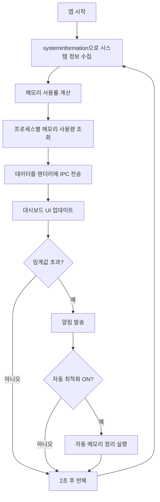
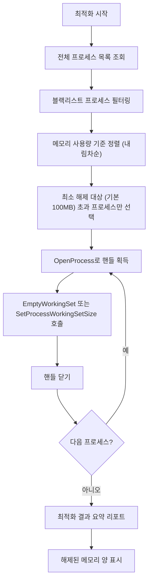

# 🧠 Windows 메모리 최적화 데스크톱 앱 개발 계획서

시스템 메모리 사용량을 실시간으로 모니터링하고, 프로세스별 분석 및 자동/수동 최적화 기능을 제공하는 Windows 데스크톱 앱을 개발합니다.

> [!NOTE]
> 이전 분석에서 확인된 문제: 시스템 메모리 66% 사용, Antigravity(908MB), language_server(550MB), Edge(211MB), Antimalware(202MB) 등의 높은 메모리 점유 상황을 기반으로 설계되었습니다.

---

## 핵심 기능 요약

| 기능 | 설명 |
|------|------|
| 📊 실시간 모니터링 | 시스템 전체 메모리 사용률, CPU 사용률 실시간 대시보드 |
| 📋 프로세스 분석 | 프로세스별 메모리/CPU 사용량 정렬, 상위 소비 프로세스 하이라이트 |
| 🧹 메모리 정리 | 사용하지 않는 프로세스 메모리 해제, 워킹셋 트리밍 |
| ⚡ 자동 최적화 | 설정한 임계값 초과 시 자동으로 메모리 정리 수행 |
| 📈 사용량 히스토리 | 시간대별 메모리 사용 추이 그래프 (최대 24시간) |
| 🔔 알림 시스템 | 메모리 임계값 도달 시 시스템 트레이 알림 |
| 🚫 블랙리스트 관리 | 정리 대상에서 제외할 프로세스 목록 관리 |
| 📦 시스템 트레이 | 최소화 시 트레이에 상주, 백그라운드 모니터링 지속 |

---

## 기술 스택

| 구분 | 기술 | 선정 이유 |
|------|------|-----------|
| 프레임워크 | **Electron** | 웹 기술로 풍부한 UI 구현, 크로스 플랫폼 잠재력 |
| 시스템 정보 | **systeminformation** | Node.js 기반 시스템 정보 수집 (CPU, 메모리, 프로세스) |
| 프로세스 제어 | **node-ffi-napi** + **Windows API** | EmptyWorkingSet, SetProcessWorkingSetSize 등 네이티브 메모리 관리 함수 호출 |
| 차트 | **Chart.js** | 가벼운 실시간 차트 라이브러리 (메모리 추이 그래프) |
| 트레이 | **Electron Tray** | 시스템 트레이 아이콘 및 컨텍스트 메뉴 |
| 설정 관리 | **electron-store** | JSON 기반 사용자 설정 영속화 |
| 패키징 | **electron-builder** | 실행 파일(.exe) + 인스톨러 빌드 |

> [!IMPORTANT]
> **관리자 권한(Admin)** 으로 실행해야 다른 프로세스의 Working Set을 트리밍할 수 있습니다. 앱 실행 시 UAC 권한 상승을 요청하도록 manifest를 설정합니다.

---

## UI 설계

### 메인 대시보드

```
┌──────────────────────────────────────────────────────────────┐
│  🧠 Memory Optimizer                              ─ □ ✕    │
├──────────────────────────────────────────────────────────────┤
│                                                              │
│  ┌──────────────────┐  ┌──────────────────┐  ┌───────────┐  │
│  │  메모리 사용량    │  │  CPU 사용률      │  │  가용 메모리│  │
│  │    ██████████     │  │     ████░░░      │  │           │  │
│  │     66%          │  │      5%          │  │  5.4 GB   │  │
│  │  10.5 / 16 GB   │  │                  │  │           │  │
│  └──────────────────┘  └──────────────────┘  └───────────┘  │
│                                                              │
│  ┌──────── 메모리 사용 추이 (최근 1시간) ────────────────┐  │
│  │  ┄┄┄┄┄╱╲┄┄╱╲╱╲┄┄┄┄╱╲┄┄┄╲╱┄┄┄┄┄┄┄┄┄┄┄╲╱┄┄┄┄         │  │
│  │  60%━━━━━━━━━━━━━━━━━━━━━━━━━━━━━━━━━━━━━━━━━         │  │
│  └───────────────────────────────────────────────────────┘  │
│                                                              │
│  ─── 상위 메모리 소비 프로세스 ─────────────── [정렬: 메모리▼] │
│  ┌──────────────────────────────────────────────────────┐  │
│  │  🔴 Antigravity (13)          908.3 MB    0.2% CPU  │  │
│  │  🔴 language_server_x64.exe   550.4 MB    0.5% CPU  │  │
│  │  🟡 Microsoft Edge (6)        211.2 MB    0.0% CPU  │  │
│  │  🟡 Antimalware Service       202.2 MB    0.2% CPU  │  │
│  │  🟢 Microsoft OneDrive (2)    152.8 MB    0.1% CPU  │  │
│  │  🟢 Windows 탐색기            144.0 MB    0.1% CPU  │  │
│  │  🟢 작업 관리자                92.2 MB    0.4% CPU  │  │
│  └──────────────────────────────────────────────────────┘  │
│                                                              │
│  [ 🧹 선택 프로세스 메모리 정리 ]  [ ⚡ 전체 최적화 ]       │
│  [ ⚙️ 설정 ]  [ 📊 상세 보고서 ]                            │
│                                                              │
└──────────────────────────────────────────────────────────────┘
```

### 설정 패널

```
┌──────────────────────────────────────────────────────────────┐
│  ⚙️ 설정                                          [← 돌아가기] │
├──────────────────────────────────────────────────────────────┤
│                                                              │
│  📋 자동 최적화 설정                                          │
│  ┌──────────────────────────────────────────────────────┐  │
│  │  자동 최적화:     [● 켜짐 / ○ 꺼짐]                  │  │
│  │  메모리 임계값:   [████████░░] 80%                    │  │
│  │  검사 주기:       [ 30초 ▼ ]                          │  │
│  │  최소 해제 대상:  [ 100 MB ▼ ] 이상인 프로세스만      │  │
│  └──────────────────────────────────────────────────────┘  │
│                                                              │
│  🔔 알림 설정                                                │
│  ┌──────────────────────────────────────────────────────┐  │
│  │  알림 임계값:     [██████░░░░] 70%                    │  │
│  │  알림 방식:       [☑ 시스템 트레이] [☑ 소리]          │  │
│  └──────────────────────────────────────────────────────┘  │
│                                                              │
│  🚫 블랙리스트 (정리 제외 프로세스)                           │
│  ┌──────────────────────────────────────────────────────┐  │
│  │  + explorer.exe                            [삭제]    │  │
│  │  + csrss.exe                               [삭제]    │  │
│  │  + svchost.exe                             [삭제]    │  │
│  │                                                      │  │
│  │  [ + 프로세스 추가 ]                                   │  │
│  └──────────────────────────────────────────────────────┘  │
│                                                              │
│  🎨 테마                                                     │
│  ┌──────────────────────────────────────────────────────┐  │
│  │  [ ● 다크 모드 ]  [ ○ 라이트 모드 ]                    │  │
│  └──────────────────────────────────────────────────────┘  │
│                                                              │
│            [ 💾 저장 ]    [ ↩ 초기화 ]                       │
└──────────────────────────────────────────────────────────────┘
```

### 디자인 컨셉
- **다크 모드** 기반 (시스템 모니터링 도구 느낌)
- **네온 그라데이션** 강조색 (메모리 사용량에 따라 초록→노랑→빨강 변화)
- **글래스모피즘** 효과의 카드 UI
- **실시간 도넛 차트** 애니메이션 (메모리/CPU 게이지)
- **파티클 배경** 효과로 프리미엄 느낌
- 프로세스 목록에 **컬러 코딩** (🔴 500MB+, 🟡 100~500MB, 🟢 100MB 미만)

---

## 프로젝트 구조

```
c:\coding\memory-optimizer\
├── package.json
├── main.js                    # Electron 메인 프로세스
├── preload.js                 # IPC 브릿지 (보안 API 노출)
├── src/
│   ├── index.html             # 메인 UI (대시보드)
│   ├── index.css              # 전체 스타일시트
│   ├── renderer.js            # 대시보드 UI 로직 (렌더러 프로세스)
│   ├── modules/
│   │   ├── monitor.js         # 시스템 정보 수집 (메모리, CPU, 프로세스)
│   │   ├── optimizer.js       # 메모리 최적화 로직 (Working Set 트리밍)
│   │   ├── auto-optimizer.js  # 자동 최적화 스케줄러
│   │   ├── history.js         # 사용량 히스토리 데이터 관리
│   │   └── notifier.js        # 알림 시스템
│   ├── components/
│   │   ├── gauge-chart.js     # 도넛 게이지 차트 컴포넌트
│   │   ├── process-list.js    # 프로세스 목록 컴포넌트
│   │   ├── history-chart.js   # 히스토리 라인 차트 컴포넌트
│   │   └── settings-panel.js  # 설정 패널 컴포넌트
│   └── utils/
│       ├── format.js          # 단위 변환 유틸리티 (bytes → MB/GB)
│       └── constants.js       # 상수 정의 (기본 블랙리스트 등)
├── native/
│   └── memory-api.js          # Windows API 바인딩 (EmptyWorkingSet 등)
└── assets/
    ├── icon.ico               # 앱 아이콘 (다크 테마용)
    ├── tray-icon.ico          # 시스템 트레이 아이콘
    └── tray-icon-warning.ico  # 경고 상태 트레이 아이콘
```

---

## 핵심 로직

### 1. 메모리 모니터링 흐름



### 2. 메모리 최적화 로직



### 3. Windows API 호출 예시

```javascript
// native/memory-api.js
const ffi = require('ffi-napi');
const ref = require('ref-napi');

const kernel32 = ffi.Library('kernel32', {
  'OpenProcess': ['pointer', ['uint32', 'bool', 'uint32']],
  'CloseHandle': ['bool', ['pointer']],
  'SetProcessWorkingSetSize': ['bool', ['pointer', 'int64', 'int64']]
});

const psapi = ffi.Library('psapi', {
  'EmptyWorkingSet': ['bool', ['pointer']]
});

/**
 * 특정 프로세스의 Working Set을 트리밍합니다.
 * @param {number} pid - 프로세스 ID
 * @returns {boolean} 성공 여부
 */
function trimProcessMemory(pid) {
  const PROCESS_SET_QUOTA = 0x0100;
  const PROCESS_QUERY_INFORMATION = 0x0400;

  const handle = kernel32.OpenProcess(
    PROCESS_SET_QUOTA | PROCESS_QUERY_INFORMATION,
    false,
    pid
  );

  if (handle.isNull()) return false;

  try {
    // Working Set을 최소화 (페이지 파일로 이동)
    return psapi.EmptyWorkingSet(handle);
  } finally {
    kernel32.CloseHandle(handle);
  }
}
```

---

## 주요 기능 상세 설계

### 📊 실시간 모니터링

| 항목 | 수집 주기 | 데이터 소스 |
|------|-----------|-------------|
| 전체 메모리 사용률 | 2초 | `si.mem()` |
| CPU 사용률 | 2초 | `si.currentLoad()` |
| 프로세스 목록 | 3초 | `si.processes()` |
| 히스토리 기록 | 30초 | 내부 버퍼 (최대 2,880개 = 24시간) |

### ⚡ 자동 최적화

| 설정 항목 | 기본값 | 범위 |
|-----------|--------|------|
| 자동 최적화 활성화 | 꺼짐 | ON/OFF |
| 메모리 임계값 | 80% | 50~95% |
| 검사 주기 | 30초 | 10~300초 |
| 최소 해제 대상 크기 | 100MB | 50~500MB |
| 쿨다운 (재실행 방지) | 5분 | 1~30분 |

### 🚫 기본 블랙리스트 (정리 제외)

```
시스템 핵심 프로세스:
- System, smss.exe, csrss.exe, wininit.exe
- services.exe, lsass.exe, svchost.exe
- explorer.exe, dwm.exe, sihost.exe
- SecurityHealthService.exe
- 현재 앱 자체 (memory-optimizer)
```

---

## 상세 구현 계획

### 1단계: 프로젝트 초기 세팅 (예상: 15분)

#### [NEW] [package.json](file:///c:/coding/memory-optimizer/package.json)
- Electron, systeminformation, ffi-napi, ref-napi, chart.js, electron-store 의존성 설정
- electron-builder 빌드 스크립트 구성
- 관리자 권한 manifest 설정

#### [NEW] [main.js](file:///c:/coding/memory-optimizer/main.js)
- Electron 메인 윈도우 생성 (1200×800)
- 시스템 트레이 아이콘 등록
- IPC 핸들러 등록 (모니터링 데이터 전송, 최적화 실행, 설정 관리)
- 윈도우 닫기 시 트레이로 최소화

#### [NEW] [preload.js](file:///c:/coding/memory-optimizer/preload.js)
- `contextBridge`로 안전한 API 노출
  - `system.getMemoryInfo()` — 메모리 정보 요청
  - `system.getProcessList()` — 프로세스 목록 요청
  - `optimizer.trimProcess(pid)` — 특정 프로세스 메모리 정리
  - `optimizer.optimizeAll()` — 전체 최적화
  - `settings.get() / set()` — 설정 읽기/쓰기
  - `on.memoryUpdate(callback)` — 실시간 모니터링 데이터 수신

---

### 2단계: UI 구현 (예상: 45분)

#### [NEW] [src/index.html](file:///c:/coding/memory-optimizer/src/index.html)
- 대시보드 레이아웃 (게이지 카드 + 차트 + 프로세스 목록)
- 설정 패널 (슬라이드 전환)
- 시스템 요약 헤더

#### [NEW] [src/index.css](file:///c:/coding/memory-optimizer/src/index.css)
- 다크 모드 컬러 팔레트 (`--bg: #0a0e17`, `--card: rgba(255,255,255,0.05)`)
- 네온 그라데이션 (`#00ff88` → `#00d4ff` 초록-청록 계열)
- 위험 단계별 색상 (`--safe: #00ff88`, `--warn: #ffaa00`, `--danger: #ff4444`)
- 글래스모피즘 카드 (`backdrop-filter: blur(20px)`)
- 도넛 차트 애니메이션 (`conic-gradient` + CSS transition)
- 프로세스 목록 hover 효과
- 스크롤바 커스터마이징

#### [NEW] [src/renderer.js](file:///c:/coding/memory-optimizer/src/renderer.js)
- IPC 수신 데이터로 UI 실시간 업데이트
- 프로세스 목록 클릭 선택/다중 선택
- 정렬 기능 (메모리/CPU/이름)
- 검색/필터 기능
- 설정 패널 토글

#### [NEW] [src/components/gauge-chart.js](file:///c:/coding/memory-optimizer/src/components/gauge-chart.js)
- Canvas 기반 도넛 게이지 렌더링
- 실시간 애니메이션 (requestAnimationFrame)
- 사용률에 따른 색상 자동 전환

#### [NEW] [src/components/process-list.js](file:///c:/coding/memory-optimizer/src/components/process-list.js)
- 가상 스크롤링 (대량 프로세스 성능 최적화)
- 컬러 코딩 뱃지 (🔴🟡🟢)
- 우클릭 컨텍스트 메뉴 (정리/종료/블랙리스트 추가)

#### [NEW] [src/components/history-chart.js](file:///c:/coding/memory-optimizer/src/components/history-chart.js)
- Chart.js 라인 차트 (메모리 사용률 추이)
- 시간 범위 선택 (1시간/6시간/24시간)
- 최적화 실행 시점을 마커로 표시

#### [NEW] [src/components/settings-panel.js](file:///c:/coding/memory-optimizer/src/components/settings-panel.js)
- 레인지 슬라이더 (임계값 설정)
- 토글 스위치 (자동 최적화 ON/OFF)
- 블랙리스트 관리 UI

---

### 3단계: 백엔드 로직 구현 (예상: 40분)

#### [NEW] [src/modules/monitor.js](file:///c:/coding/memory-optimizer/src/modules/monitor.js)
- `getSystemMemory()` — 전체/사용/가용 메모리 조회
- `getCpuUsage()` — CPU 사용률 조회
- `getProcessList()` — 프로세스 목록 (PID, 이름, 메모리, CPU)
- `startMonitoring(interval)` — 주기적 모니터링 시작
- `stopMonitoring()` — 모니터링 중지

#### [NEW] [src/modules/optimizer.js](file:///c:/coding/memory-optimizer/src/modules/optimizer.js)
- `trimProcess(pid)` — 단일 프로세스 Working Set 트리밍
- `optimizeAll(options)` — 전체 최적화 (블랙리스트 적용)
- `getOptimizationReport()` — 최적화 결과 리포트 생성

#### [NEW] [src/modules/auto-optimizer.js](file:///c:/coding/memory-optimizer/src/modules/auto-optimizer.js)
- `start(config)` — 자동 최적화 스케줄러 시작
- `stop()` — 스케줄러 중지
- 쿨다운 타이머 관리
- 최적화 이벤트 로깅

#### [NEW] [src/modules/history.js](file:///c:/coding/memory-optimizer/src/modules/history.js)
- 링 버퍼 기반 메모리 사용률 기록
- 시간대별 데이터 조회 API
- 최적화 이벤트 마커 관리

#### [NEW] [src/modules/notifier.js](file:///c:/coding/memory-optimizer/src/modules/notifier.js)
- `notify(title, body, type)` — 시스템 트레이 알림 발송
- 알림 중복 방지 (동일 알림 쿨다운)
- 알림 히스토리

#### [NEW] [native/memory-api.js](file:///c:/coding/memory-optimizer/native/memory-api.js)
- Windows API 바인딩 (kernel32, psapi)
- `EmptyWorkingSet` / `SetProcessWorkingSetSize` 래퍼
- 에러 핸들링 및 로깅

---

### 4단계: 시스템 트레이 & 통합 (예상: 20분)

#### [UPDATE] [main.js](file:///c:/coding/memory-optimizer/main.js)
- 트레이 아이콘 등록 (일반/경고 상태 아이콘 전환)
- 트레이 컨텍스트 메뉴 (열기, 즉시 최적화, 자동 최적화 토글, 종료)
- 윈도우 닫기 시 트레이 최소화 동작
- 더블클릭으로 창 복원

---

## 안전장치 & 예외 처리

| 상황 | 대응 |
|------|------|
| 시스템 프로세스 정리 시도 | 블랙리스트 + PID 0/4 자동 제외 |
| 관리자 권한 없이 실행 | 경고 표시 + 모니터링만 가능 모드 |
| EmptyWorkingSet 실패 | 개별 실패 건 로깅, 나머지 프로세스 계속 처리 |
| 메모리 부족 상태에서 앱 실행 | 앱 자체 메모리 사용량 최소화 (< 80MB 목표) |
| 과도한 자동 최적화 | 쿨다운 타이머로 연속 실행 방지 |
| 프로세스 종료(killed) 감지 | 자동 목록 새로고침, 에러 무시 |

---

## 검증 계획

### 수동 테스트

1. **앱 실행 확인**
   - `npm start` 로 앱 실행
   - 다크 모드 대시보드가 정상 렌더링되는지 확인
   - 게이지 차트 애니메이션 동작 확인

2. **실시간 모니터링 테스트**
   - 메모리 / CPU 사용률이 2초 간격으로 업데이트되는지 확인
   - 프로세스 목록이 올바르게 정렬되는지 확인
   - 큰 프로그램(브라우저 등) 실행/종료 시 실시간 반영 확인

3. **메모리 최적화 테스트**
   - 특정 프로세스 선택 후 "선택 정리" 실행
   - "전체 최적화" 실행 후 실제 메모리 감소 확인
   - 블랙리스트 프로세스가 정리에서 제외되는지 확인
   - 시스템 프로세스 정리 시도 시 안전하게 스킵되는지 확인

4. **자동 최적화 테스트**
   - 임계값을 낮게 설정 후 자동 최적화 트리거 확인
   - 쿨다운 동안 재실행되지 않는지 확인
   - 알림이 정상 발송되는지 확인

5. **시스템 트레이 테스트**
   - 앱 닫기 시 트레이로 최소화되는지 확인
   - 트레이 아이콘 더블클릭으로 복원되는지 확인
   - 트레이 컨텍스트 메뉴 동작 확인

6. **히스토리 차트 테스트**
   - 시간 범위 변경 시 차트 업데이트 확인
   - 최적화 이벤트 마커 표시 확인

---

## 예상 소요 시간

| 단계 | 예상 시간 |
|------|-----------|
| 프로젝트 세팅 (Electron + 의존성) | 15분 |
| UI 구현 (대시보드 + 설정 + 컴포넌트) | 45분 |
| 백엔드 로직 (모니터링 + 최적화 + 자동화) | 40분 |
| 시스템 트레이 & 통합 | 20분 |
| 테스트 & 디버깅 | 30분 |
| **합계** | **~150분 (2시간 30분)** |

---

## 향후 확장 가능 기능 (Phase 2)

| 기능 | 설명 |
|------|------|
| 📊 프로세스 상세 분석 | 메모리 맵, DLL 목록, 핸들 수 등 상세 정보 |
| 🔄 시작 프로그램 관리 | Windows 시작 프로그램 활성화/비활성화 |
| 💾 가상 메모리 관리 | 페이지 파일 크기 최적화 제안 |
| 📤 리포트 내보내기 | 메모리 분석 보고서 PDF/CSV 내보내기 |
| 🌐 원격 모니터링 | 웹 대시보드를 통한 원격 시스템 모니터링 |
| 🎯 프로세스 그룹핑 | 관련 프로세스 자동 그룹핑 (예: Chrome 탭들) |
| ⏰ 스케줄 최적화 | 특정 시간대에 자동 최적화 실행 |
